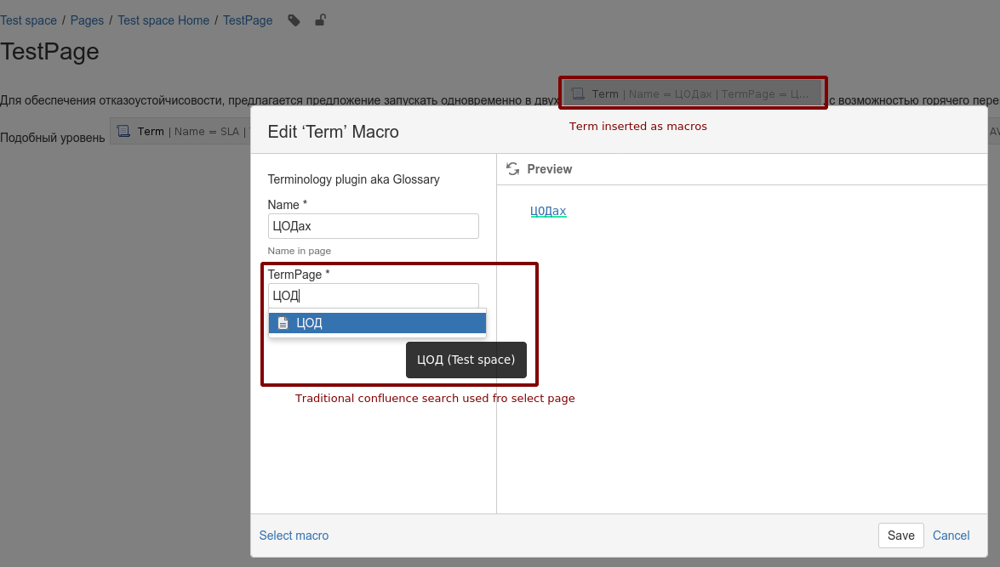

# confluence-terminology-plugin
Simple Terminology highlight plugin (macros) for Atlassian confluence

There are many paid plugins for confluence to manage `Terminology` or `Glossary`. Fore example, [Smart Terms for Confluence - Glossary](https://marketplace.atlassian.com/apps/1219677/smart-terms-for-confluence-glossary?hosting=server&tab=overview) or [Glossary - Terminology Manager](https://marketplace.atlassian.com/apps/1219513/glossary-terminology-manager?hosting=server&tab=overview) you may buy it if it fit to your needs. Meantime it was not our case unfortunately. And proprietary code do not give you possibility change it as you want.

In search of opensource glossary plugin I've found: [Glossary](https://marketplace.atlassian.com/apps/1217138/glossary?hosting=server&tab=overview). Basically that fine and I highly recommend that plugin (and even their templates should be helpful with my macros). But that lack major functionality for me: it maintain terms pages, but do **not highlight terms on pages**.

> **I've post [future request](https://bitbucket.org/keysight/keysight-plugins-for-atlassian-products/issues/70/fr-please-highlight-all-terms-on-page-and) but it has been closed as **`WANTFIX`**.
It was the main reason I start such development after do not found free replacement.**

# Development

Here are the SDK base commands you'll use immediately:

* `atlas-run`   -- installs this plugin into the product and starts it on localhost
* `atlas-debug` -- same as atlas-run, but allows a debugger to attach at port 5005
* `atlas-cli`   -- after atlas-run or atlas-debug, opens a Maven command line window:
                 - 'pi' reinstalls the plugin into the running product instance
* `atlas-help`  -- prints description for all commands in the SDK

Full documentation is always available at: <https://developer.atlassian.com/display/DOCS/Introduction+to+the+Atlassian+Plugin+SDK>

## Dev resources

1. Base [tutorial](https://developer.atlassian.com/server/framework/atlassian-sdk/create-a-confluence-hello-world-macro/). Tutorial [source](https://bitbucket.org/serverecosystem/myconfluencemacro/src/master/).
2. <https://www.k15t.com/blog/2015/03/building-a-glossary-and-checking-terminology-in-confluence> - good problem description, mentioned aforementioned Glossary plugin and some other alternatives.
3. [Good example how to add self macros into Confluence **without** any plugins](https://thedetaildept.com/2011/08/13/building-a-glossary-in-confluence/). Very interesting and useful. Actually that work was start in that manner. But there several disadvantages:
   * Can't add resources
   * For any term macros included with `JS` and `CSS`
   * Very hard to debug `Velocity` template...
